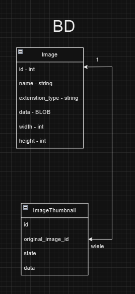
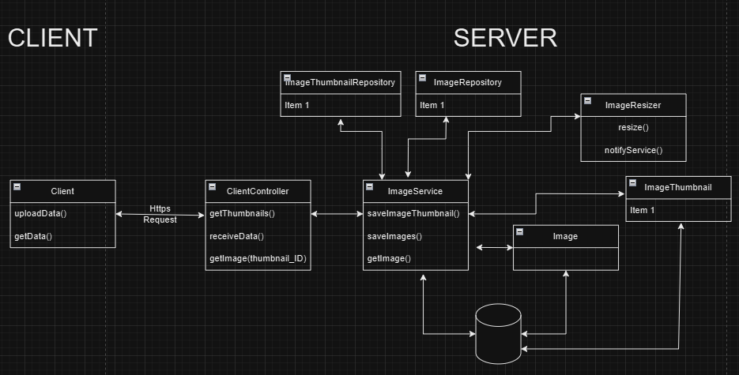
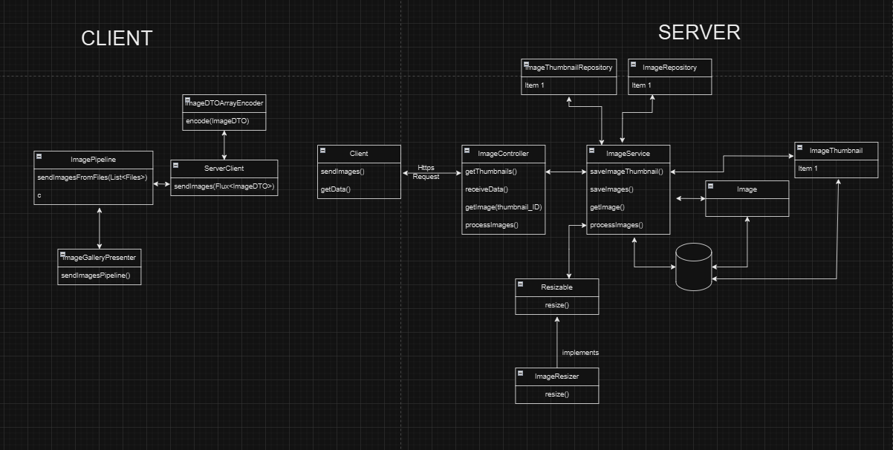
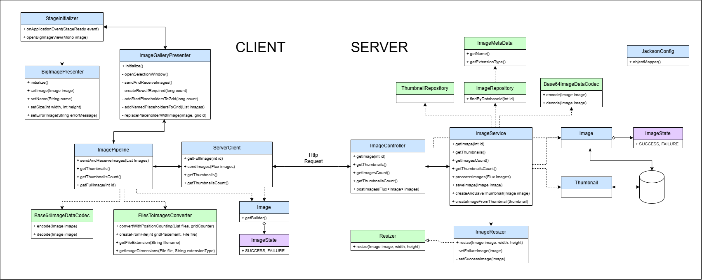
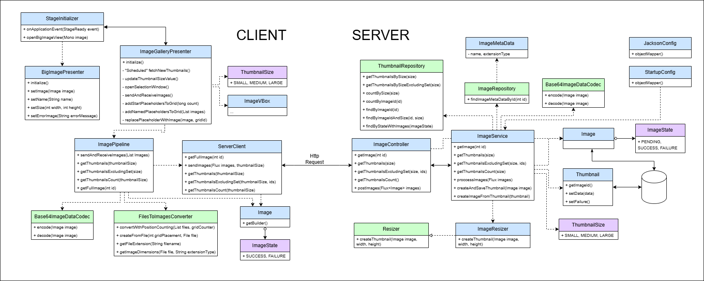

# ReaktywniApp

## Authors

- Mateusz Bobula
- Konrad Tendaj
- Bartosz Knapik

## 7.12.2023 - Basic Ideas

    

Technologies
- Spring-boot
- WebFlux
- Swing for clientSide
- webClient
- JDBC for database

    

## 13.12.2023 - First Milestone

### Changes in conceptions
- decided to use javaFX rather than Swing

### Main functionalities
- different sizes and formats of images are supported
- it is possible to send one package of images after package

### Client
- Client Frontend
    - GUI Elements
        - Button responsible for choosing files
        - Button responsible for sending files
        - Grid responsible for displaying thumbnails
    - GUI Functionalities
        - Chosing images that will be sent
        - Sending images
        - Clicking on a thumbnail opens the original image in a new window
        - Displaying ready thumbnails in a grid or loading icons
- Client Backend
    - Logic responsible for connecting with server
    - Logic responsible for sending images to server
    - Logic responsible for reactive receiving thumbnails from server
    - Logic responsible for showing big image

### Server
- Server Backend
    - DataBase
        - Created database for storing images and thumbnails data
        - Saving images in database
        - Saving thumbnails in databse
    - Logic responsible for getting images from client
    - Logic responsible for reactive and asynchronic creation of thumbnails
    - Logic responsible for reactive and asynchronic sending thumbnails to client
    - Logic responsible for resizing image

### Class diagram

    

## 20.12.2024 - First Milestone (after review fixes)

### Client
- Fixed window freeze while loading big image in BigImageView
- Showing error in BigImageView when image couldn't be loaded
- Improved ImageGalleryView initialization with alert pop-up
- Changed ImageGalleryView initialization to download thumbnails count rather than images count
- Tweaked placing image in ImageGalleryView
- Improved exception handling
    - FilesToImagesConverter throws IOException
    - ImageGalleryPresenter handles FilesToImagesConverter exception with alert pop-up
- Replaced System.out.print with loggers
- Changed ReaktywniClientApp to use on Profile "dev" and "prod" rather than excluding "test"
- Changed active profile to "dev" in application.properties

### Server
- Improved exception handling
    - createImageFromThumbnail returns Optional
    - getImage() in ImageService returns Mono with error HTTP 404 if image not found
    - getThumbnailsCount() in ImageService returns Mono with error if it cannot get thumbnails count
    - Resizer set imageStatus to FAILED if image cannot be resized
- Replaced System.out.print with loggers
  - Increased StreamReadConstraint maxStringLength to handle bigger images (tested on 80MB image)
- Transported getImage logic from ImageController to ImageService
- Added getThumbnailsCount
- Changed test checking with StepVerifier, expectNextMatches and verifyComplete

### Class diagram

    

## 3.01.2025 - Second Milestone

### Client
- Changed UI language to english
- Added thumbnails size slider with 3 sizes
- sendAndReceiveImages() method in ImagePipeline now returns Flux<Images> rather than using presenter
- ImageGalleryPresenter changes:
    - Added enum ThumbnailSize with 3 sizes to packet "util"
    - Added scheduled fetching of new thumbnails
    - Extracted class ImageVBox to packet "util"
    - Added thumbnailSize and size slider initialization
    - Added refreshing grid logic with thumbnails of new size
    - Refactored downloadAndPlaceThumbnails() to use new ImageVBox
    - Refactored replacePlaceholderWithImage to use new ImageVBox
- Refactored methods in ImagePipeline and ServerConnector to work with different thumbnail sizes

### Server
- Added new ImageState: PENDING
- Set new Image imageStatus to PENDING
- Thumbnail changes:
    - Added new attributes: (size) type and ImageState state 
    - Changed constructor to include type and exclude data 
    - Added new methods: setData() and setFailure()
- Added new config class StartupConfig to create thumbnails if not present
    - method createEmptyThumbnailsIfMissing() save empty thumbnails in database if not present
    - method reprocessPendingThumbnails() reprocess thumbnail creation for pending and failed thumbnails
- Added handling different thumbnail sizes in ImageController, ImageService and ThumbnailRepository
- ImageMetaData is now a record instead of a interface
- ImageService
    - Transformed blocking database calls to be handled in "Mono.fromCallable" on different thread
    - Added new method getThumbnailsExcludingSet() to send only thumbnails that are new to client
    - Changed processImage() to calculate thumbnails for all sizes. Thumbnails in the size of other than required are processed on other thread.
    - Before processing new thumbnails, server save empty thumbnails in database and then process them and update
- Thumbnail table in database has now new indexes to speed up fetching thumbnails
- Changed imageId in Thumbnail to be a foreign key to Image table
- Added enum ThumbnailSize with 3 sizes
- Resizer create thumbnail rather than editing image data
- Fixed tests to work with new features

### Class diagram

    

